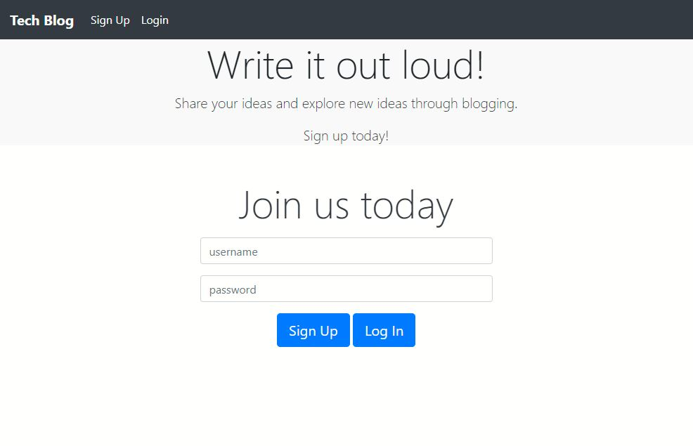
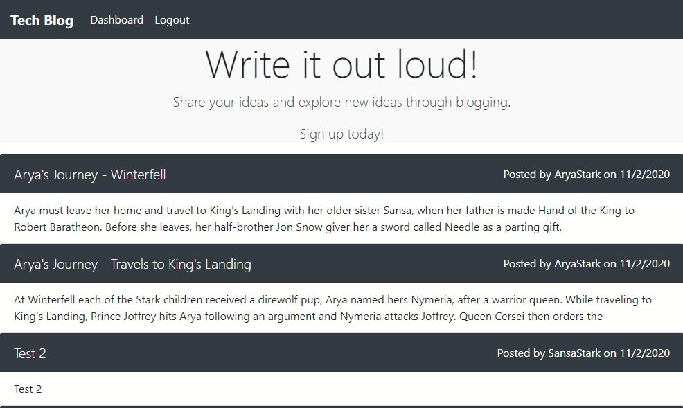

# Tech Blog

# License
  

  

# Table of Contents

- [Description](#description)
- [Installation](#installation)
- [Test](#test)
- [Usage](#usage)
- [Links](#links)
- [Questions](#questions)
- [Screenshot](#screenshot)

# Description
This is an interactive tech-blog where you can create a user, create a post and enables you to see all users' blog posts and comment on them.  This website can be turned into a social media platform as well. 

# Built With
- Javascript
- NPM express
- Node.js
- Sequelizer
- Insomnia REST Client
- dotenv package
- MySql
- Heroku

# Installation
No need for installing.  A deployed website link is available below.

# Usage
- Visit the website: https://thawing-temple-74323.herokuapp.com/
- Create a new user by clicking Sign Up.
- Create a new post (post what your heart desires).
- Comment on your own post, comment on someone else's post.
- Edit and delete your post.
- You may also check the feed and your own dashboard.

# Links
- Link to the Blog: https://thawing-temple-74323.herokuapp.com/
- Link to repository: https://github.com/itsrheine/tech-blog

# Questions
If you have any questions or concerns, please feel free to reach out to my:
- Email: [mtiamsic@gmail.com](mtiamsic@gmail.com)
- Github: [itsrheine](https://github.com/itsrheine)

# Screenshot

